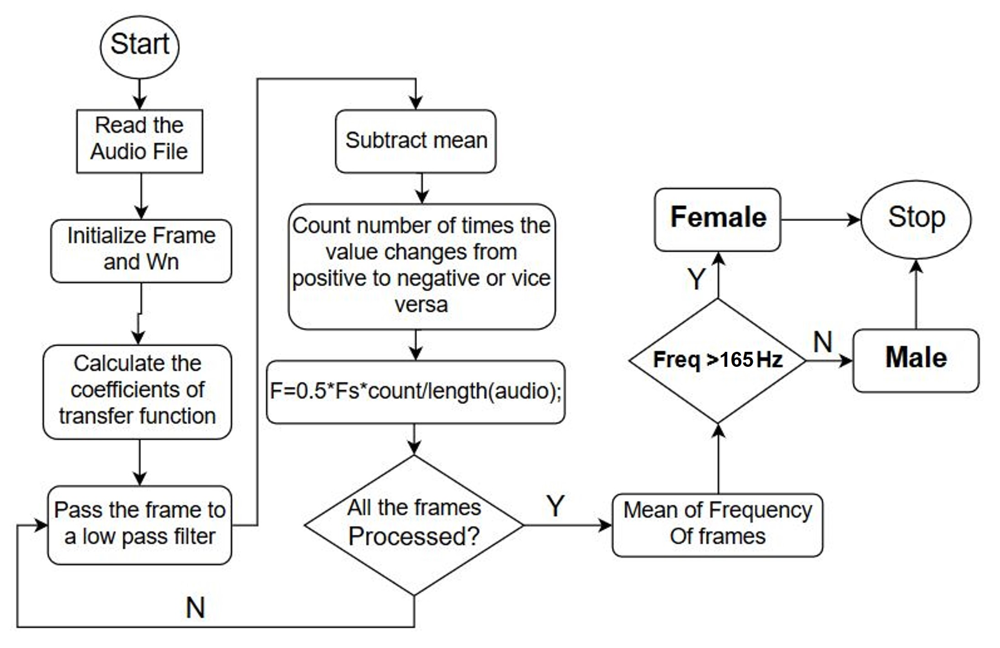

# Male-Female Voice Recognition
Recognize whether the voice is of a male ar female.

## Introduction

The fundamental frequency of a typical male ranges somewhere from  85 Hz to 165 Hz. While, the fundamental frequency of a typical female ranges somewhere from 165 Hz to 260 Hz. (In real-world frequencies for male and female might have a bit different range of frequency due to human-biological factors).

### Method 1 - Using in-built pitch function
                                                    [f0,inx] = pitch(audioIn,fs)
It straightway returns the fundamental frequency, f0 of any input audio file with sampling frequency fs. Thus, we can directly compare it with 165 Hz and report whether the voice is of a male or a female.

Limitation - Works only in Matlab 2018 or later

### Method 2

Run **Male_Female_Voice Recognizer.m** file to identify using this method.

